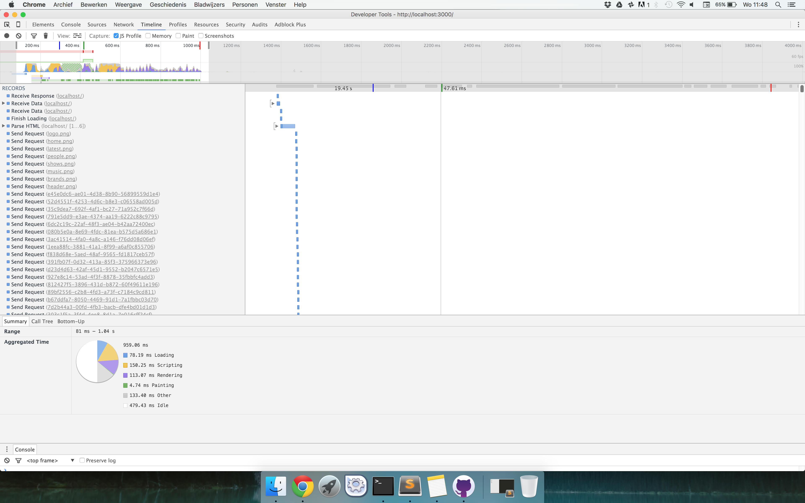
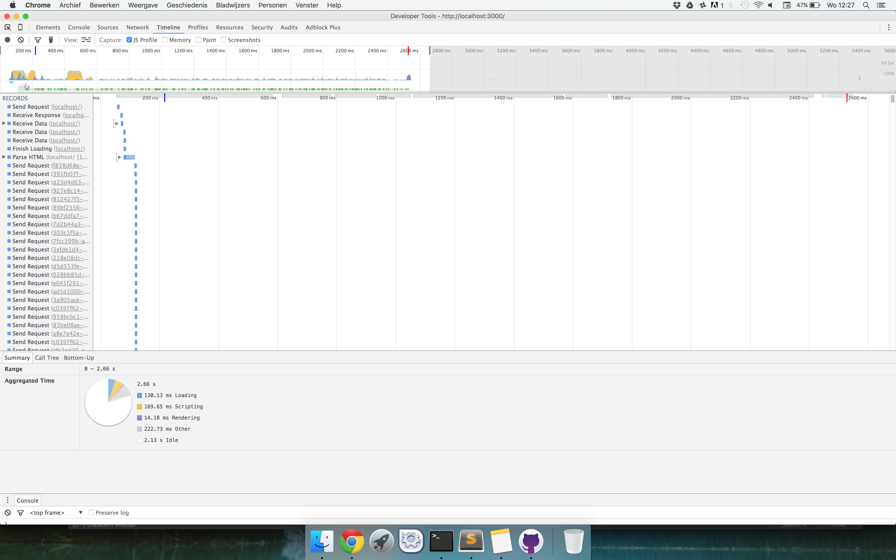
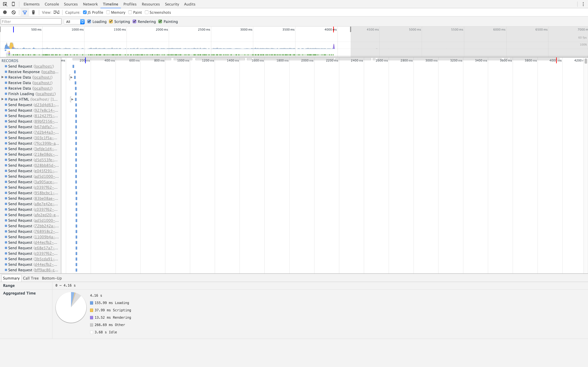
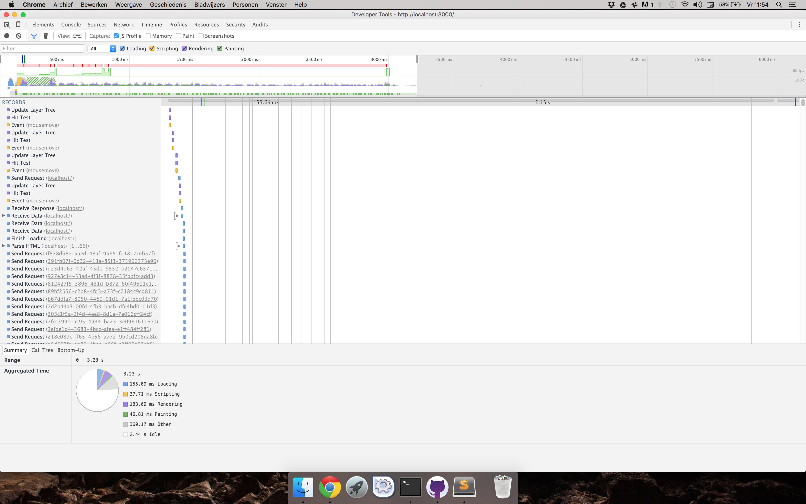
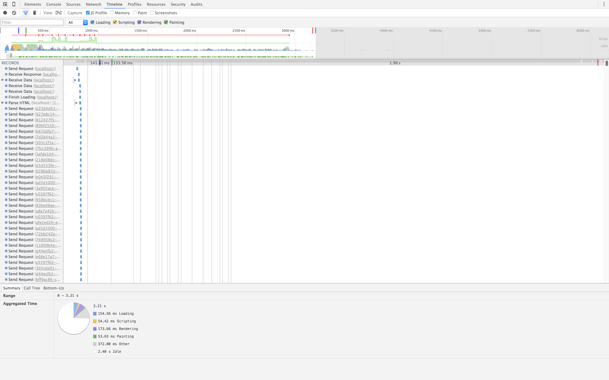
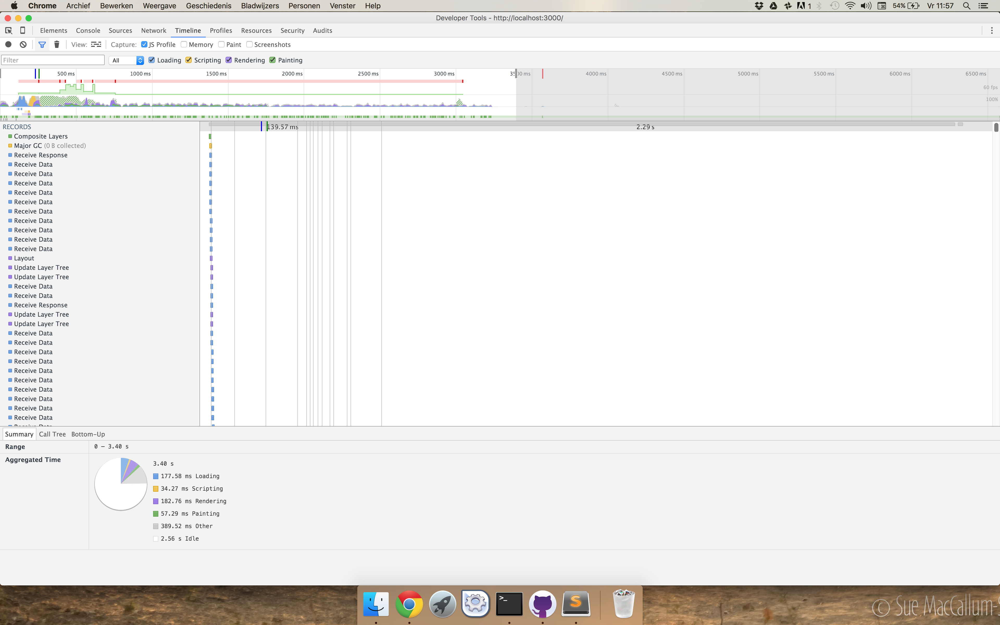
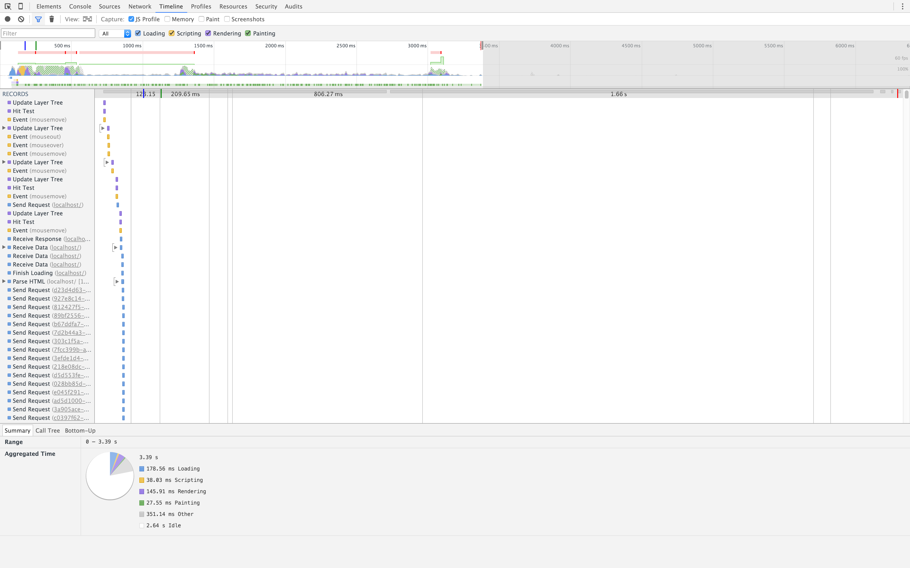

# LookLive server Rosa Schuurmans
## Analysis

### HTML semantisch maken
Before:

After:

### CSS optimaliseren
Before:

After:

#### Icon sprites toevoegen
Before:

After:

#### responsive header images
Before:

After:

### one page app maken
Before:

After:

### google font link aangepast
### header img nog kleiner
### jquery weg

